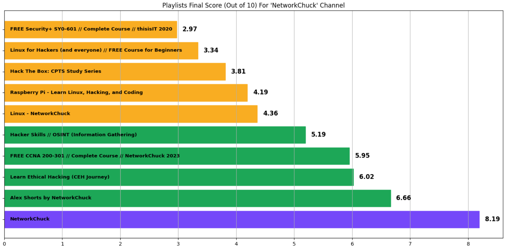

# YouTube-Channel-Analysis
## Overview
The **YouTube Channel Analysis** Project is a powerful tool that leverages **`Python`** and the **`YouTube Data API`** to analyze playlists and provide valuable insights into video performance for a specific channel.

By examining viewer engagement through total views and like percentages, channel owners can strategically tailor their content to maximize audience interest and drive growth.

Additionally, this analysis helps identify which topics resonate most with viewers, enabling creators to make informed decisions when launching products, services, or courses based on audience preferences.

## Skills Demonstrated
* **Python Programming**: Effective use of **`Python`** for data retrieval and processing.
* **API Integration**: Working with the **`YouTube Data API`** to fetch channel and playlist data.
* **Data Normalization**: Implementing scoring systems to compare playlist performance.
* **Data Analysis**: Calculation of key metrics, including total views and likes-to-views ratio.
* **Data Visualization**: Creation of informative visualizations using **`Matplotlib`** to communicate insights clearly.

## Features

* **Playlist Retrieval**: Automatically fetches all playlists associated with a specified YouTube channel.
* **Video Metrics Calculation**: Analyzes each video in the playlists to compute total views and percentage of likes.
* **Normalized Scoring System**: Generates a final score for each playlist based on weighted engagement metrics (70% for views / 30% for likes), making it easy to identify top-performing content.
* **Visual Insights**: Displays the top 10 playlists in a horizontal bar chart, clearly indicating viewer engagement levels.

## Usage

1. **Clone the Repository**:
   ```git clone https://github.com/yourusername/YouTube-Playlist-Analysis.git```

2. **Install Required Packages**: Ensure you have the necessary Python packages installed:
   
   ```pip install requests pandas matplotlib google-api-python-client```
3. **Rename The **`.env.example`** file to `.env`**.
4. **Add your API Key to the **`.env`** file**.
5. **Run the Notebook**: Execute the notebook and replace the placeholders in the code with your desired channel's ID.
6. **Explore Insights**: Review the generated bar chart to understand which topics engage viewers the most.

## Example
* Here is an example of analyzing the YouTube channel for the NetworkChuck:
  


* Here we can say that one of the best performing playlists is the **Ethical Hacking Playlist**, so it is better for him to make a course around **CEH** as it wil most likely succeed.

## Contact
For questions or contributions, please reach out to me at zakoutkhalil@gmail.com. You can also connect with me on [LinkedIn](https://www.linkedin.com/in/khalil-zakout/).
